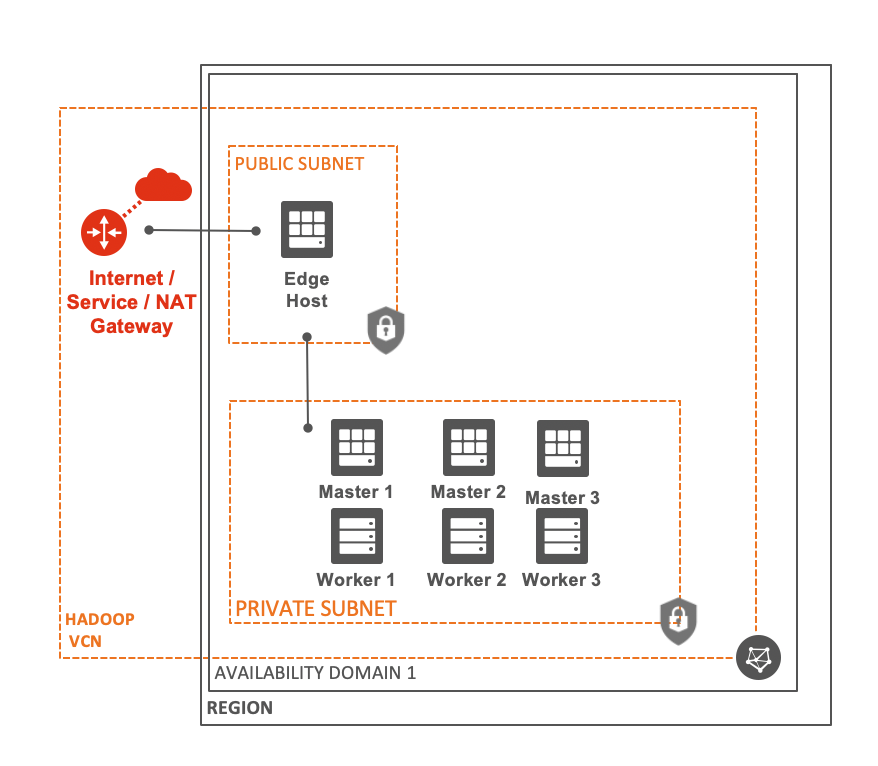

# oci-hadoop
Apache Hadoop on OCI

## Deployment
This template uses [Oracle Resource Manager](https://docs.oracle.com/en-us/iaas/Content/ResourceManager/Concepts/resourcemanager.htm) to deploy an [Apache Hadoop](http://hadoop.apache.org) cluster on OCI.  The schema driven install will guide you through customization options available prior to deployment.

Simply click the Deploy to OCI button here to initiate deployment of the stack.

## Architecture
Here is a diagram of the deployment architecture when creating a VCN as part of the stack deployment:

## Hadoop Components
Cluster service topology is as follows:
* Master 1 is NameNode and JobHistory server
* Master 2 is ResourceManager, Timeline, Proxy and History Server
* All Master hosts are ZooKeeper servers

Edge node has client libraries deployed in .bashrc for root user.   Cluster hosts have deployment logs in /var/log/OCI-Hadoop.log which can be used to triage any deployment issues.
